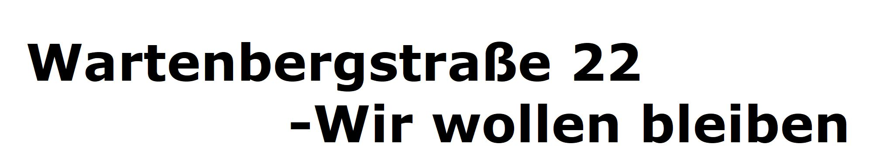

####                      find us on Facebook [Wartenburg Berlin](https://www.facebook.com/wartenburgberlinbleibt/)

Das Haus wurde von uns als solidarisches Kollektiv 2016 erworben und wieder aufgepeppelt, mit der Vision einen Ort zu schaffen, 
an dem wir leben, arbeiten und uns intensiv austauschen können.

Die Wartenburg ist ein 5 stöckiger Altbau
mit angrenzendem Garten in der Wartenbergstr. 22
10365 Berlin/ Lichtenberg, Baujahr 1893.
Ihr kennt uns von der Ringbahn (zw Ostkreuz und Frankfurter Allee) 


Hier wird gelebt, geliebt,
gelacht, geweint, diskutiert und kreiert.
Jetzt sollen wir unser eigenes Haus räumen, bevor ein Urteil im Hauptprozess gefällt wurde. 
Die Nutzungsuntersagung ist unrechtens und wiederspricht den notwendigen Wohnpolitischen Zielen dieser Stadt. 
Wir wollen unser Haus nicht dem Zerfall überlassen.


<br />
<br />


## [Kreativ](Kreativ)

Wir bauen alles selbst.
Die Wartenburg soll Plattform für
Handwerk, Kunst und Kultur sein.
Wir bauen Werkstätten, geben künstlerische Workshops,
sind eine Präsentations- und Förderplattform für akustische und visuelle Kunst 
und kuratieren Perfomance und Theater in Berlin und Weltweit.


## [Solidarisch](Solidarisch)

In einer anonymen Großstadt wie
Berlin vergisst man schnell den
Gemeinschaftsgedanken.
Unser Haus soll ein Ort der Begegnung
sein, in dem jede_r willkommen ist.
Wir sind über unser Hausprojekt hinaus
solidarisch, wenn Hilfe benötigt wird.
Hierbei laden wir unsere Nachtbarschaft in unsere Gemeinschafts- und Veranstaltungsräume, in unsere Werkstätten und
zu unserem kulturellen und informellen Veranstaltungen
ein um sich zu begegnen und um gemeinsam zu gestalten.

Wir wollen stadtnah erschwingliche
Mietpreise für Kleingewerbe und Wohnen
ermöglichen.

##   [Ökologisch](oekologisch)

Erhalt statt Neubau!
Wir retten alte Bausubstanzen und
recyceln Baumaterialien.
Wir fahren zum Messe-Abbau,
holen altes Holz oder Türen
aus Häusern, bevor sie abgerissen
werden. Arbeiten in ökovisionären Berufen und 
Engagieren uns in der Lebensmittelrettung.
Wir arbeiten an Solarzellen auf dem Dach
und an einer Wasseraufbereitungsanlage.

##  [                  <br />                          Was uns bedroht:](Wasunsbedroht)
<br />
Akut will uns der Bezirk die Nutzung
untersagen und droht mit Räumung.

en:
Juristisch
Das Bauamt Lichtenberg will uns die Nutzung
untersagen. Vorgeschobener Grund:
Das Gebäude hätte zu lange leergestanden.
Wir versuchen dagegen vorzugehen und Bestandsschutz
einzuklagen.
Das Liegenschaftsamt, das Finanzamt und das
Grundbuchamt führen das Haus immer schon als
Wohngebäude.
Politisch
Bestandsschutz kann uns auch die Politik zusichern,
solange das Haus in einem statisch guten Zustand ist:
Wir haben ein Statik-Gutachten vorliegen,
welches dem Haus beste Gesundheit diagnostiziert.
Es bedarf nichts weiter als etwas politischem
Willen, um die Wartenburg zu retten.
 
 
### -> Nutzung alter Bausubstanz statt Leerstand!
Warum fördert der Bezirk
Leerstand ?

<br />
<br />

Wir besitzen und bewohnen die Wartenburg gemeinsam. Restaurieren, Planen, Gestalten, tragen Organisation und Verantwortung gemeinsam.
##[                                                                                       Wer wir sind](werwirsind)
 
 
 
<br />
<br />

<br />
 


 


Jede solidarische Unterstützung und
Erfahrungsaustausch zum Thema ist sehr
willkommen.
Danke! Ruwen, Rianne, Skena, Katrin, Micha
Der mit Hut, Cathrin, Carsten, Ina, Arne,
Yoyo, Adrian, Tristan, Palia, Hill, Nikete, Annika, Tomas, Jule, Gerad, Christopfer,
Thea, Martin, Kalli, Ali, Jonny, Chris, Jack, Ralf, Frank & friends


wartenburg.hausprojekt@gmail.com
Wartenburg Berlin
BERLIN, SEPTEMBER 2018


[our first page building the internets of the burg!](our_first_page)

You can use the [editor on GitHub](https://github.com/w22liebt/w22liebt.github.com/edit/master/README.md) to maintain and preview the content for your website in Markdown files.

Whenever you commit to this repository, GitHub Pages will run [Jekyll](https://jekyllrb.com/) to rebuild the pages in your site, from the content in your Markdown files.


To learn about the configuration of the options you can go to [here](https://jekyllrb.com/docs/configuration/)

### Markdown

Markdown is a lightweight and easy-to-use syntax for styling your writing. It includes conventions for

```markdown
Syntax highlighted code block

# Header 1
## Header 2
### Header 3

- Bulleted
- List

1. Numbered
2. List


**Bold** and _Italic_ and `Code` text

[Link](url) and

For more details see [GitHub Flavored Markdown](https://guides.github.com/features/mastering-markdown/).

### Jekyll Themes

Your Pages site will use the layout and styles from the Jekyll theme you have selected in your [repository settings](https://github.com/w22liebt/w22liebt.github.com/settings). The name of this theme is saved in the Jekyll `_config.yml` configuration file.

### Support or Contact

Having trouble with Pages? Check out our [documentation](https://help.github.com/categories/github-pages-basics/) or [contact support](https://github.com/contact) and we’ll help you sort it out.
