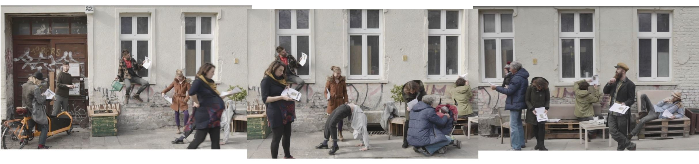
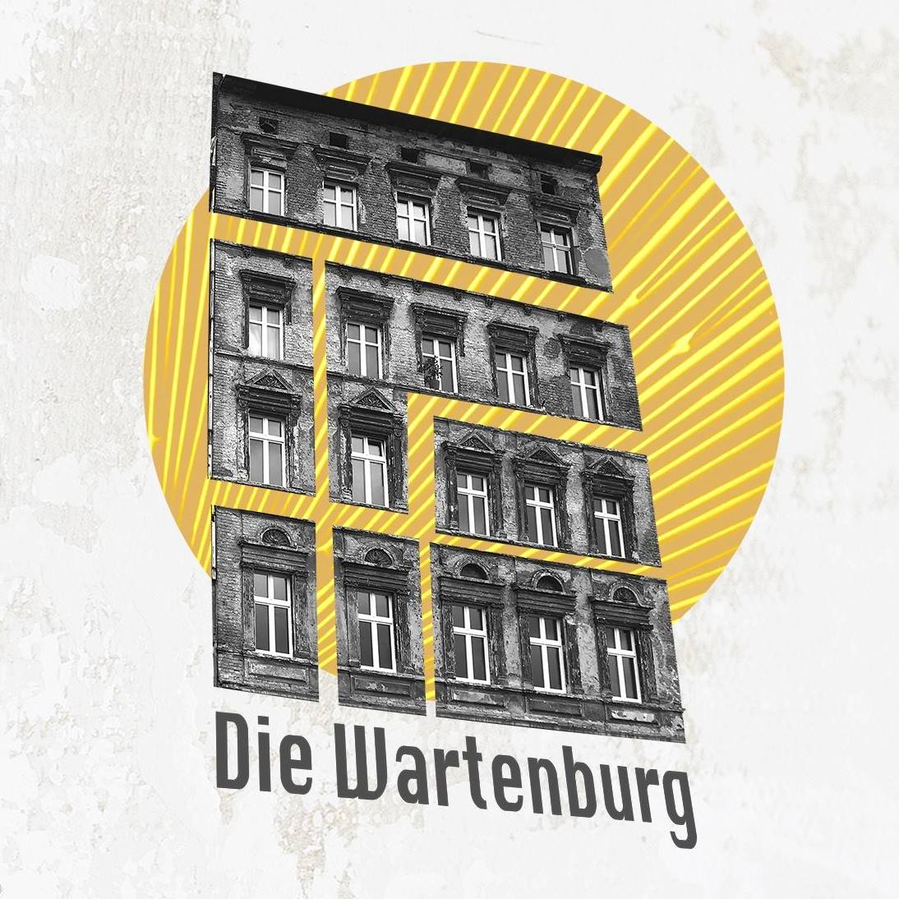
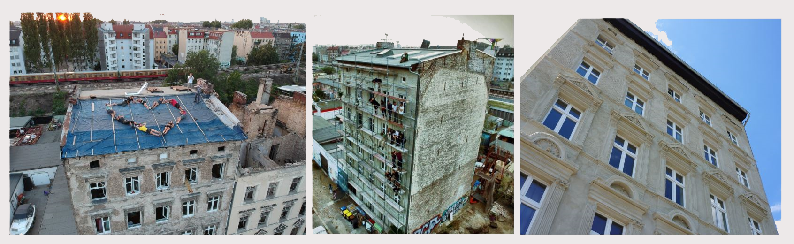
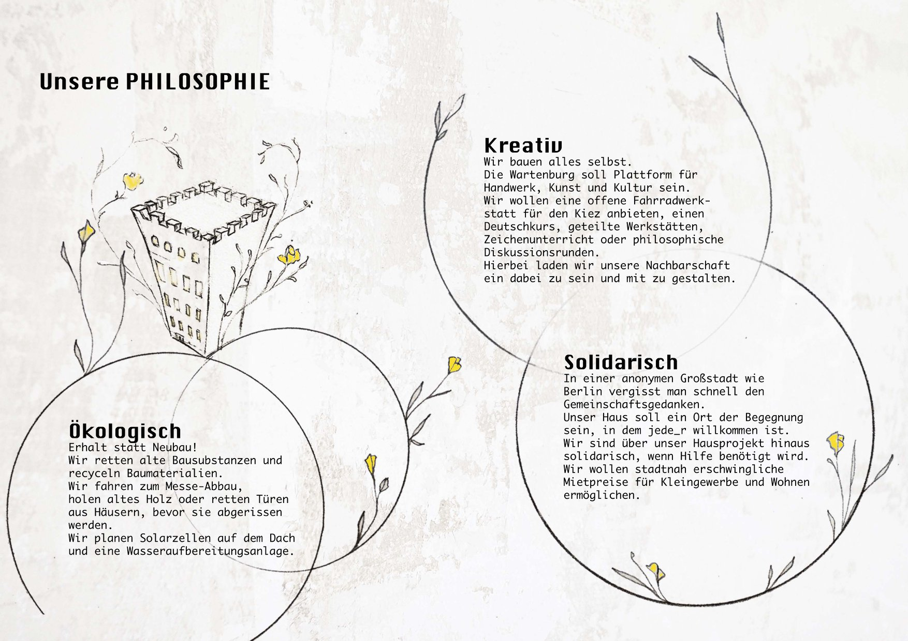
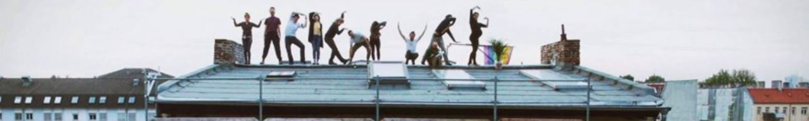
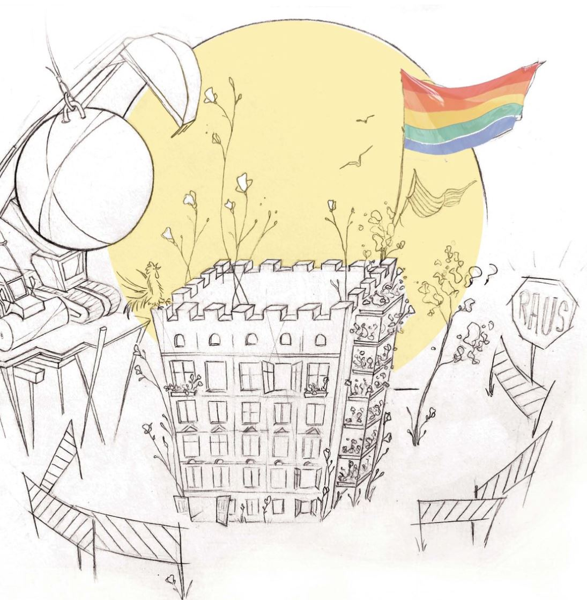

 
## Niedrige Mieten statt Leerstand - Erhalt statt Neubau
 
### [ ! Bitte unterschreibt HIER und rettet unseren Wohn- und Lebensraum ! ](petition.pdf)

## [Abgabe der Unterschriftenzettel:](petition.pdf) 
  per Post ODER Postbox an unserer Haustür: Wartenbergstraße 22, 10365 Berlin ODER am Sonntag den 16. Mai von 10 – 15 Uhr bei unserem „Tag vor der offenen Tür“

 

Das Haus wurde von uns als solidarisches Kollektiv 2016 erworben und renoviert, mit der Vision einen Ort zu schaffen, 
an dem wir leben, arbeiten und uns intensiv austauschen und kreativ sein können.

Die Wartenburg ist ein 5 stöckiger Altbau, der als typisches Berliner Wohnhaus im Jahre 1893 
mit angrenzendem Garten in der Wartenbergstr. 22 in 10365 Berlin/ Lichtenberg errichtet wurde.

#### [                                          Ihr kennt uns von der Ringbahn (zw. Ostkreuz und Frankfurter Allee)]

 
Hier wird gelebt, geliebt,
gelacht, geweint, diskutiert und kreiert.
Jetzt sollen wir unser eigenes Haus räumen, bevor ein Urteil im Hauptprozess gefällt wurde. 
Die Nutzungsuntersagung ist unrechtens und widerspricht den notwendigen wohnpolitischen Zielen dieser Stadt. 
[Wir wollen unser Haus nicht dem Zerfall überlassen(Klick Hier)](zerfall)

 

##  [                                          Was uns bedroht:](Wasunsbedroht)
 
#### Akut will uns der Bezirk die Nutzung untersagen und droht mit Räumung
 
Das Bauamt Lichtenberg untersagt uns die Nutzung für unser Gebäude und droht mehrere 10.000€ Strafe an, wenn wir es nicht räumen. Das Bauamt behauptet wider besseren Wissens, dass unser Haus nie ein Wohnhaus, sondern immer schon Gewerbehaus war und deshalb nicht bewohnt werden kann. Obwohl die Vorbewohner bekannt sind, die Telefon- und Adressbücher seit 1893 nachzuvollziehen sind und Mitarbeiterinnen des Amtes unter der Hand zugeben, dass das Haus immer schon Wohnhaus war, sollen wir nun ausziehen.
Wir empfinden es als einen Skandal, dass wir noch vor dem eigentlichen Gerichtsurteil ausziehen müssen und dass das Amt zu solchen Mitteln greift. Diese Frage soll eigentlich in einem regulären Gerichtsprozess entschieden werden. Dem Amt geht das allerdings nicht schnell genug. Wegen „negativer Vorbildwirkung einer neu begonnenen Nutzung“ fordert es, dass wir das Haus sofort räumen und bis zu einer richterlichen Entscheidung leer stehen lassen. Als Konsequenz eines ähnlichen Vorgehens durch das Amt wurde das Nachbargebäude [Wartenbergstraße 21 (Klick Hier)](Wartenbergstr21) nach längerem Leerstand abgerissen.
Bereits in den ersten Kommunikationen mit dem Amt wurden wir dazu aufgefordert, einen Bauantrag für ein Gewerbegebäude zu stellen. Diese Forderung würde für uns bedeuten, dass wir einen klassischen Berliner Wohnbau, wie ihn Tausende von Berlinern bestandsgeschützt bewohnen, zu einem Gewerbegebäude nach aktuellem Baurecht umbauen müssten. Hölzerne Türen, Böden und Treppenauflagen müssten Stahl und Beton weichen. 
Die Forderung des Amts beruht auf zwei Punkten, die gerichtlich bereits entschieden wurden bzw. Gegenstand des noch ausstehenden Hauptprozesses sind. Wir haben als Gruppe in Eigenleistung ein Gebäude wieder vollständig nutzbar gemacht und sollen es nun bis zum [Hauptprozess (Klick Hier)](Hauptprozess) den Gefahren des Leerstands preisgeben. Unter Strafandrohung werden wir dazu aufgefordert, woanders nach Mietmöglichkeiten zu suchen. 

Das Liegenschaftsamt, das Finanzamt und das
Grundbuchamt führen das Haus immer schon als
Wohngebäude.
Bestandsschutz könnte uns auch die Politik zusichern,
solange das Haus in einem statisch guten Zustand ist.
(Wir haben ein Statik-Gutachten vorliegen,
welches dem Haus beste Gesundheit diagnostiziert.)
Es bedarf also nichts weiter als etwas politischen
Willen, um die Wartenburg zu retten.
Um diesen bemühen wir uns seit Beginn des Konfliktes.
 
##### -> Nutzung alter Bausubstanz statt Leerstand!

 
 
##  [                                         Was wir wollen: ](Waswirwollen)
 
Wir besitzen und bewohnen die Wartenburg.
Wir restaurieren, planen, gestalten und tragen die Organisation sowie Verantwortung gemeinsam für uns und unser erweitertes Umfeld.

  
### [Kreativ](Kreativ)

-künstlerisch und handwerklich arbeitende Bewohner des Hauses
 
 (Filmemacherinnen, Fotografin, Maler, Theatermacher, Tänzerinnen, Plastiker, Tischler, Restaurator, Steinmetze, Segel- und Zeltmacherin, Köche und Bootsbauer) 
  
-Ausstellungsflächen für Künstler mit Ringbahnblick
 
-regelmäßiges Musizieren mit Bewohnern, Gästen, Kindern und eingeladenen Musikern
 
-Gemeinschaftsflächen für Kunst und Kulturvorhaben 
 
-beliebter Ort für Filmdrehs und Fotoshootings 
 
-Artistiktrainingsfläche im Innenhof 
 
-“Außenstelle“ Esperantos (selbstgebauter Hochseekatamaran segelt als Theaterbühne und Wassermessstation dieses Jahr vom Schwarzen Meer nach Griechenland)

### [Solidarisch](Solidarisch)

-Residenzförderprogramm für Frauen mit innovativen Ideen zur Verbesserung der Welt 
 
-gesicherter, günstiger Wohnraum  
-aktive Unterstützungen für private und berufliche Vorhaben aller Bewohner 
 
-Inspiration und Kompetenzaustausch 
 
-Einsatz für lebendige und entanonymisierte Hausgemeinschaft UND Nachbarschaft 
 
-Kiezführungen zu Lichtenberger Sehenswürdigkeiten 
 
-internationale Bewohner mit Sprachtandem 
 
-kostenloses Gästezimmer für Reisende, Volontäre und Neuankömmlinge 
 
-Pflege der umliegenden Außenflächen 
 
 (Nachbargrundstück wird zum Garten, Cleaning-up-actions, Fassadenrenovierung) 
  

###  [Ökologisch](oekologisch)

-Erhalt der ursprünglichen Bausubstanz 
 
-Bau mit traditionellen, Re- und upcyclingmaterialien 
 
-Rettung von historischen Baustoffen aus Abrissprojekten 
 
-Verbesserung des Wärmeisolationswertes 
 
-Solaranlagen ergänzen den Stromverbrauch 
 
-aktive und organisierte Lebensmittelrettung und Verteilung 
 
-Anlegen eines Gartens Wartenbergstr. 22+21 
 
-Grünfassade mit Brauchwasseraufbereitung (in Planung) 
 
-Fledermausschutzprogramm 
 
-Gemeinschaftsauto für große Transporte – Rest mit Fahrrad oder Öffis 
 
 

##  [                                                                                       Wer wir sind: (Klick Hier) ](Werwirsind)
 
 
 
 

 

 
 

 
####                      find us on Facebook [Wartenburg Berlin   (Klick Hier)](https://www.facebook.com/wartenburgberlinbleibt/)
 
Jede solidarische Unterstützung und jeder
Erfahrungsaustausch zum Thema ist sehr
willkommen.
Danke! Ruwen, Rianne, Skena, Katrin, Micha
Der mit Hut, Cathrin, Carsten, Ina, Arne,
Yoyo, Adrian, Tristan, Palia, Hill, Nikete, Annika, Tomas, Jule, Gerad, Christopfer,
Thea, Martin, Kalli, Ali, Jonny, Chris, Jack, Ralf, Frank & friends

DerRuinBerlin@gmail.com
Wartenburg Berlin
BERLIN, JULI 2020

